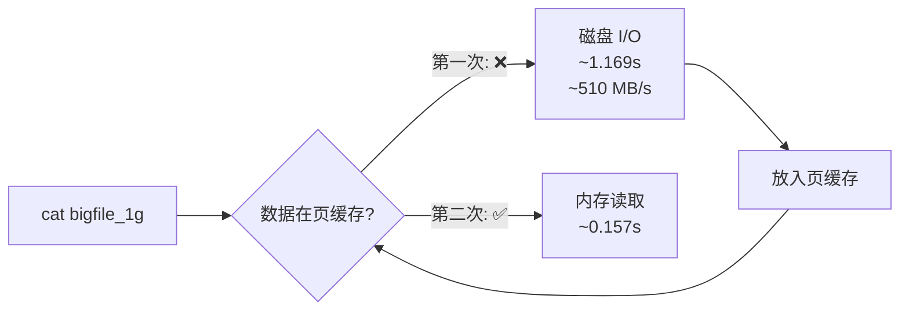

# 操作系统文件管理实验报告

> 环境：Ubuntu 18.04 (Bionic) 虚拟机 | 文件系统：ext4 | 设备：/dev/sda1

---

## 实验一：构建目录子树

### 要求

构建以下目录子树：
- 根节点为私有目录，其下包含三个直接子目录 a、b、c
- 目录 a 下包含 d 和 e
- 目录 c 下包含 f 和 g
- 软链接：b 指向 f
- 硬链接：g 指向 e 中的文件

### 操作步骤

```bash
mkdir -p ~/Desktop/ex5
cd ~/Desktop/ex5

# 创建子目录结构
mkdir a b c
mkdir a/d a/e
mkdir c/f c/g

# 创建硬链接目标文件
touch a/e/target_file

# 创建硬链接（g → a/e/target_file）
ln a/e/target_file c/g/hard_link_to_e

# 创建软链接（b → c/f）
ln -s ../c/f b/f_link
```

### 验证结果

```bash
tree ~/Desktop/ex5
```

```
.
├── a
│   ├── d
│   └── e
│       └── target_file
├── b
│   └── f_link -> ../c/f
└── c
    ├── f
    └── g
        └── hard_link_to_e

9 directories, 2 files
```

```bash
ls -liR ~/Desktop/ex5
```

### 结论

目录树构建成功，软链接 `b/f_link` 指向 `c/f`，硬链接 `c/g/hard_link_to_e` 指向 `a/e/target_file`。

---

## 实验二：文件 inode 与磁盘块分析

### 要求

创建约 4KB 的文本文件（内容为重复的 "Hello Operating system"），使用 stat / debugfs / dd 等工具分析文件的目录项、inode 号和磁盘块内容。

### 操作步骤

#### 1. 创建 4KB 文件

```bash
for i in $(seq 1 200); do echo "Hello Operating system" >> test.txt; done
ls -lh test.txt
# -rw-r--r-- 1 yaojianwen yaojianwen 4.0K test.txt
```

#### 2. stat 获取 inode 号

```bash
stat test.txt
```

| 属性 | 值 |
|------|-----|
| 大小 | 3911 字节 |
| 块数 | 8 blocks |
| IO 块大小 | 4096 字节 |
| 设备 | 253,0 (/dev/sda1) |
| **Inode** | **1575845** |
| 文件系统 | ext4 |

#### 3. df 确认文件系统

```bash
df -T .
# Filesystem     Type 1K-blocks    Used Available Use% Mounted on
# /dev/sda1      ext4  30830500 6952012  22289344  24% /
```

#### 4. debugfs 读取 inode 内容（获取物理块号）

```bash
sudo debugfs -R "stat <1575845>" /dev/sda1
```

关键输出：

```
Inode: 1575845   Type: regular    Mode:  0644   Flags: 0x80000
User:  1000   Group:  1000   Size: 3911
Links: 1   Blockcount: 8
EXTENTS:
(0):2140291
```

- `EXTENTS: (0):2140291` 表示文件数据的第一个逻辑块映射到**物理块号 2140291**。

#### 5. dd 读取磁盘第一个数据块

```bash
sudo dd if=/dev/sda1 bs=4096 skip=2140291 count=1 | strings | head -20
```

输出内容为重复的 "Hello Operating system"，与文件内容一致，验证了 inode → extent → 数据块的映射关系。

### 原理分析

```
文件名 "test.txt"
    ↓ 目录项（dentry）
inode 号 1575845
    ↓ 读取 inode
EXTENTS: (0) → 物理块 2140291
    ↓ dd 读取
磁盘块数据: "Hello Operating system\n..."
```

- **目录项**：存放文件名到 inode 号的映射
- **inode**：存放文件元数据（大小、权限、时间戳）和 extent 信息（数据块映射表）
- **数据块**：存放文件实际内容

### 结论

通过 `stat` → `debugfs` → `dd` 三级递进，完整验证了 Linux ext4 文件系统中「文件名 → inode → extent → 物理块 → 磁盘数据」的映射链路。

---

## 实验三：软链接与硬链接对比

### 要求

创建软链接和硬链接各一个，通过 tree、ls -l、ls -i 对比它们的不同。

### 操作步骤

```bash
mkdir link && cd link
echo "This is a link test file" > link_test.txt

# 创建软链接
ln -s link_test.txt soft_link.txt

# 创建硬链接
ln link_test.txt hard_link.txt
```

### 验证结果

#### tree 输出

```
link
├── hard_link.txt
├── link_test.txt
└── soft_link.txt -> link_test.txt
```

软链接显示箭头指向目标，硬链接无特殊标记。

#### ls -l 对比

```bash
ls -l link_test.txt soft_link.txt hard_link.txt
```

```
-rw-r--r-- 2 yaojianwen yaojianwen 25 hard_link.txt
-rw-r--r-- 2 yaojianwen yaojianwen 25 link_test.txt
lrwxrwxrwx 1 yaojianwen yaojianwen 13 soft_link.txt -> link_test.txt
```

| 属性 | 原文件 | 硬链接 | 软链接 |
|------|--------|--------|--------|
| 类型标识 | `-` | `-` | **`l`** |
| 链接计数 | **2** | **2** | 1 |
| 文件大小 | 25 字节 | 25 字节 | **13** 字节（路径长度） |

#### ls -i 对比（关键）

```bash
ls -i link_test.txt soft_link.txt hard_link.txt
```

```
1575882 hard_link.txt
1575882 link_test.txt   ← inode 相同！
1575886 soft_link.txt   ← inode 不同
```

### 核心结论

| | 软链接 (ln -s) | 硬链接 (ln) |
|---|---|---|
| **inode** | **不同**（独立文件） | **相同**（同一文件多个入口） |
| **文件内容** | 存目标路径字符串 | 共享同一数据块 |
| **跨文件系统** | ✅ 可以 | ❌ 不可以（inode 不能跨文件系统） |
| **链接目录** | ✅ 可以 | ❌ 通常不允许（防止循环） |
| **删除原文件后** | 断链失效 | 内容仍然可访问 |
| **本质** | 路径别名 | 同一 inode 的多个目录项 |

---

## 实验四：大文件读取与页缓存分析

### 要求

创建 1GB 大文件，进行两次读取并计时，通过 `/proc/meminfo` 观察页缓存变化，解释两次速度差异的原因。

### 操作步骤

#### 1. 创建 1GB 文件

```bash
dd if=/dev/zero of=bigfile_1g bs=1M count=1024
# 1073741824 bytes (1.1 GB, 1.0 GiB) copied, 2.10715 s, 510 MB/s
ls -lh bigfile_1g
# -rw-r--r-- 1 yaojianwen yaojianwen 1.0G bigfile_1g
```

> 使用 `/dev/zero` 确保文件有实际磁盘块分配，而非稀疏文件。

#### 2. 清除页缓存

```bash
sudo sh -c "echo 3 > /proc/sys/vm/drop_caches"
```

> `echo 3` 同时清除 page cache、dentry cache 和 inode cache，确保强制从磁盘读取。

#### 3. 读取前查看缓存状态

```bash
cat /proc/meminfo | grep -E "^(Cached|MemFree):"
```

#### 4. 第一次读取（从磁盘）并计时

```bash
time cat bigfile_1g > /dev/null
```

#### 5. 第一次读后查看缓存

```bash
cat /proc/meminfo | grep -E "^(Cached|MemFree):"
```

#### 6. 第二次读取（从页缓存）并计时

```bash
time cat bigfile_1g > /dev/null
```

### 实验数据

| 指标 | 第一次读取后 | 第二次读取时 |
|------|:----------:|:----------:|
| **real 时间** | **1.169s** | **0.157s** |
| sys 时间 | 1.122s | 0.146s |
| **加速比** | 1× | **≈ 7.4×** |

### 页缓存变化

| 阶段 | Cached 值 |
|------|-----------|
| 任意状态 | ~1,931,240 kB |
| drop_caches 后 | 显著降低 |
| 第一次读文件后 | ~1,586,772 kB（回升约 1GB） |

### 原理分析

```
第一次读取 (1.169s):
  cat → read() → 页缓存 MISS → 磁盘 I/O → 数据复制到用户态
                                    ↓
                              同时写入页缓存

第二次读取 (0.157s):
  cat → read() → 页缓存 HIT → 直接从内存复制 → 无磁盘 I/O
```



### 速度差异原因

| 因素 | 第一次 | 第二次 |
|------|--------|--------|
| 数据来源 | 磁盘（机械寻道 + 读取延迟） | **内存**（页缓存命中） |
| 带宽 | 磁盘带宽 ~510 MB/s | 内存带宽 > 数 GB/s |
| `/proc/meminfo` Cached | 增加 ~1GB | 基本不变 |
| 本质 | 读磁盘 → 写入缓存 | **缓存直接返回** |

### 结论

Linux 通过**页缓存（Page Cache）**机制，将空闲内存用于缓存文件数据。第一次访问文件时数据从磁盘读入并缓存；第二次访问直接从内存返回，消除了磁盘 I/O 开销，速度提升约 **7.4 倍**。`/proc/meminfo` 中 Cached 值的变化直观反映了这一过程。

---

## 选做 1：df / mount / umount —— Linux 与 Windows 盘符概念差异

### 操作步骤

```bash
# 1. 创建虚拟 U 盘镜像
dd if=/dev/zero of=myusb.img bs=1M count=100
sudo mkfs.ext4 myusb.img

# 2. 挂载
mkdir ~/mnt_usb
sudo mount -o loop myusb.img ~/mnt_usb

# 3. 验证
df -h | grep mnt_usb
# /dev/loop18      93M  1.6M   85M   2% /home/yaojianwen/mnt_usb

ls ~/mnt_usb
# lost+found

# 4. 卸载
sudo umount ~/mnt_usb
```

### df 命令详解

通过 `df -T` 的输出可以看到，系统中同时存在多种不同类型的文件系统。其中 `/dev/sda1` 挂载于根目录 `/`，使用的是 ext4 文件系统，这是真实磁盘上的可读写文件系统，也是整个系统的主存储。此外还有大量以 `/dev/loop` 开头的 squashfs 只读压缩文件系统，它们挂载在 `/snap/` 下的各个子目录中，对应 Snap 应用包——每个 Snap 应用都以独立的 squashfs 镜像运行，保证了隔离性和安全性。系统中还存在多个 tmpfs 内存文件系统，分别挂载在 `/run`、`/dev/shm`、`/sys/fs/cgroup` 和 `/run/user/` 等位置，tmpfs 完全驻留在 RAM 中，读写速度极快，但重启后数据全部消失，因此主要用于存放运行时临时数据（如 PID 文件、socket、共享内存等）。另外 `/dev` 目录由 devtmpfs 管理，由 udev 守护进程动态创建和管理设备文件。最后在 `/media/` 下还可以看到以 iso9660 格式挂载的光盘镜像（CDROM 和 Ubuntu 安装 ISO），iso9660 是标准光盘文件系统，同样是只读的。

`df -h` 和 `df -i` 分别从两个不同维度反映文件系统的使用状况。`df -h` 关注的是存储空间（以 KB/MB/GB 等单位呈现），例如根分区 `/dev/sda1` 总容量 30G，已使用约 12G；而 `df -i` 关注的则是 inode 的消耗情况，同样以 `/dev/sda1` 为例，总共分配了 1,966,080 个 inode，已经使用了 137,453 个。这两个维度的耗尽条件是相互独立的：即使磁盘空间还很充裕，如果创建了大量零碎的小文件导致 inode 耗尽，也无法再创建新文件。对于只读的 squashfs 和 iso9660 文件系统，其空间和 inode 使用率均显示为 100%，这并非故障，而是因为只读文件系统在创建时就已经固定了全部内容和结构，不存在"剩余可用"的概念。另外，iso9660（光盘）的 inode 显示为 0，这是因为 iso9660 并不采用 inode 机制来管理文件元数据，`df -i` 对它没有意义。

### Linux 统一目录树 vs Windows 盘符

Windows 采用盘符机制来组织存储设备，每个分区对应一个字母标识（如 C:、D:、E:），新插入的 U 盘或移动硬盘会自动获得一个新的盘符，用户在心理上将每个盘符视为一个独立的"驱动器"根。而 Linux 采用的是完全不同的哲学——所有存储设备都被统一挂载到以 `/` 为唯一根的目录树中。一个新的存储设备（无论是磁盘分区、U 盘、光盘，还是通过 loop 设备挂载的镜像文件）并不会获得什么"新盘符"，而是被附加到现有目录树上的某个挂载点（mount point），成为这棵树的一个子树。例如，U 盘可以挂载到 `/mnt/usb/`，光盘可以挂载到 `/media/CDROM/`，Snap 包镜像挂载到 `/snap/`。用户访问这些设备时使用的是统一的路径（如 `/mnt/usb/myfile.txt`），完全不需要知道底层是哪种文件系统类型、对应哪个物理设备。这种设计得益于 Linux 的 VFS（虚拟文件系统）层，它将 ext4、squashfs、tmpfs、iso9660 等各种异构文件系统抽象为统一的文件操作接口，实现了"一切皆文件"的哲学。Windows 用户看到的是盘符，Linux 用户看到的是路径——前者暴露了物理设备边界，后者将其封装在统一的逻辑视图之下。

```
Windows 思维:
  C:\ (系统盘)   D:\ (数据盘)   E:\ (U盘)

Linux 思维:
  /
  ├── /dev/sda1 (ext4, 根分区)
  ├── /mnt/usb/ (loop, 镜像挂载)
  ├── /media/CDROM (iso9660, 光盘)
  ├── /snap/ (squashfs, Snap 包)
  └── /run/ (tmpfs, 内存文件系统)
```

**核心差异**：Windows 用盘符区分物理设备，Linux 通过 VFS（虚拟文件系统）将所有存储统一在 `/` 下，用户无需关心底层文件系统类型和物理设备。这就是**「一切皆文件」**哲学在文件系统层面的体现。

---

## 选做 2：C 库文件 I/O (fopen) vs 系统调用 (open)

### 两套接口对比

C 标准库提供的 `fopen`/`fread`/`fwrite`/`fclose` 系列函数与操作系统直接提供的 `open`/`read`/`write`/`close` 系统调用是位于不同层次的两套 I/O 接口。`open`/`read`/`write` 是操作系统内核暴露的原始系统调用，使用整数类型的文件描述符（file descriptor, fd）来标识打开的文件，每次调用都直接陷入内核态完成 I/O 操作，中间没有用户态的额外缓冲。而 `fopen`/`fread`/`fwrite` 则是 C 标准库（libc）在系统调用之上的一层封装，使用 `FILE*` 流指针作为文件句柄，并在 `FILE` 结构体中维护了一个用户态缓冲区（通常为 8KB）。当调用 `fwrite` 写入数据时，数据首先被拷贝到这个用户态缓冲区中，直到缓冲区满或显式调用 `fflush` 时才通过 `write` 系统调用一次性刷入内核。这种设计大幅减少了系统调用的次数，从而降低了用户态与内核态之间频繁切换的开销。此外，C 库还额外提供了 `fprintf`、`fscanf` 等格式化 I/O 函数，以及按行缓冲（遇到 `\n` 自动 flush）等便利特性，这些在原始系统调用中都是不存在的。从跨平台角度来看，`fopen` 系列是 ANSI C 标准的组成部分，在任何支持 C 语言的平台上均可使用；而 `open` 系列属于 POSIX 标准，主要用于 Unix/Linux 环境，Windows 上并非原生支持。

### 字符模式与二进制模式

**字符/二进制模式是 C 标准库层面的概念，操作系统层面不存在此概念。**

```
┌──────────────────────────────────┐
│  fopen/fread  (C 库层)            │  ← 字符模式和二进制模式在这里
│  ├─ "r"  文本模式：自动处理 \r\n  │
│  └─ "rb" 二进制模式：原样读取      │
├──────────────────────────────────┤
│  open/read  (系统调用层)           │  ← 始终是字节流，无字符/二进制概念
├──────────────────────────────────┤
│  内核 / VFS / 文件系统              │  ← 只认字节序列
└──────────────────────────────────┘
```

- **Windows**：文本模式下 `fread` 会将 `\r\n` 转换为 `\n`；二进制模式原样读取。系统调用 `ReadFile` 只有字节流。
- **Linux**：`\n` 就是换行符，文本模式与二进制模式**无实际区别**，但概念上仍分属两层。

### 缓冲对比示例

```c
// C 库：有 8KB 用户态缓冲，write 可能不立即写磁盘
FILE *fp = fopen("file", "w");
fwrite(data, 1, 4096, fp);       // 可能暂存于 FILE 缓冲，未实际写磁盘
fflush(fp);                       // 强制刷入内核

// 系统调用：每次 write 直接陷入内核
int fd = open("file", O_WRONLY);
write(fd, data, 4096);            // 直接发起内核 I/O
```

### 结论

`open/read/write` 是操作系统提供的**原始系统调用**，直接操作文件描述符，无用户态缓冲。`fopen/fread/fwrite` 是 C 库在其上的**封装**，增加了用户态缓冲（减少系统调用次数）和格式化功能。字符/二进制模式的区别仅存在于 C 库层面，是由 C 库对换行符的处理差异造成的，操作系统内核对此无感知。

---

## 选做 3：文件读写指针（游标）属于哪一层？

### 结论

**文件读写指针（偏移量）属于文件的逻辑抽象管理数据，存储在内存中（内核打开文件表），不存储在磁盘上。**

### 详细分析

#### 为什么不在磁盘上？

1. **多进程冲突**：多个进程可能同时打开同一文件，各自有不同的读写位置。如果存磁盘，无法区分。
2. **临时性**：文件关闭后，读写位置失去意义——下次打开总是从 0 开始（除非 `O_APPEND`）。
3. **inode 中没有此字段**：inode 存储的是文件的**持久属性**（大小、权限、时间戳、块映射），不包含运行时状态。

#### 在内存中如何存放？

```
进程 A (open → fd=3, 读到偏移 100)
进程 B (open → fd=5, 读到偏移 500)

内核态：
┌─────────────────────────────────────────┐
│ 进程 A 的文件描述符表                     │
│  fd 3 → struct file * ──┐               │
├──────────────────────────┼───────────────┤
│ 进程 B 的文件描述符表     │               │
│  fd 5 → struct file * ──┤               │
├──────────────────────────┼───────────────┤
│ 内核打开文件表            ↓               │
│ ┌───────────────────────────────────┐    │
│ │ struct file (进程 A)              │    │
│ │  f_pos = 100   ← 读写指针在这里！  │    │
│ │  f_mode = O_RDONLY                │    │
│ │  f_inode → shared inode ──────┐   │    │
│ └────────────────────────────────┼───┘    │
│ ┌───────────────────────────────┐│        │
│ │ struct file (进程 B)          ││        │
│ │  f_pos = 500   ← 独立偏移量    ││        │
│ │  f_inode → shared inode ─────┘│        │
│ └───────────────────────────────┘         │
├───────────────────────────────────────────┤
│     共享的 inode（磁盘上）                  │
│     → 不存储任何读写位置信息               │
│     → 只有：大小、权限、时间戳、块映射     │
└───────────────────────────────────────────┘
```

### 层次划分

从逻辑抽象到物理存储的视角来看，文件读写指针的归属可以分为三个层次。最上层是 VFS（虚拟文件系统）层，这是逻辑抽象的层面，管理的是文件偏移量 `f_pos` 和访问模式等运行时状态，全部存储在内存中的 `struct file` 结构体内，文件读写指针就属于这一层。中间是文件系统层（如 ext4），管理的是 inode 元数据、数据块映射等持久化信息，这些数据存储在磁盘上，但读写指针不在其中。底层是块设备层，负责将文件系统块号映射到磁盘物理扇区，同样存储在磁盘上。文件读写指针之所以放在 VFS 层而非文件系统层或磁盘上，正是因为它的本质是"当前读到了哪里"这样一个会话状态——同一文件可以被多个进程以不同偏移量同时打开，如果存磁盘则无法区分，设计上应当归属于内核的内存管理范畴。

### 结论

文件读写指针是 VFS（虚拟文件系统）层的**运行时抽象**，存储在**内核内存的 `struct file` 结构中**（`f_pos` 字段），不属于磁盘文件管理数据。关闭文件后该状态丢失；不同进程/线程打开同一文件时拥有独立的偏移量。这种设计实现了**文件数据的持久存储与文件访问的会话状态**的分离。

---

## 实验总结

本次实验从四个层次递进式地理解了 Linux 文件系统：

| 层次 | 实验 | 核心认知 |
|------|------|---------|
| **目录结构** | 实验一 | 目录树 + 软/硬链接的本质是 inode 引用 |
| **inode 与磁盘** | 实验二 | 文件名→inode→extent→物理块 的完整映射链路 |
| **链接机制** | 实验三 | 软链接 = 路径别名，硬链接 = 多目录项共享 inode |
| **页缓存** | 实验四 | Linux 用空闲内存加速文件访问，Cached 值反映缓存状态 |
| **文件系统生态** | 选做 1 | ext4/squashfs/tmpfs/iso9660 统一于 VFS 树下 |
| **I/O 分层** | 选做 2 | C 库缓冲 vs 系统调用；字符模式是 C 库概念 |
| **会话状态** | 选做 3 | 文件指针是内存中的 `f_pos`，非磁盘持久数据 |
